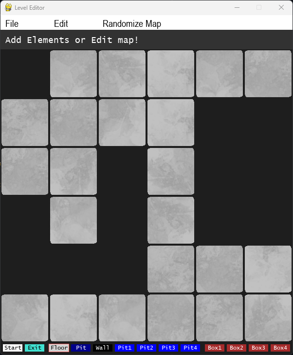

# Escape The Werehouse!
My first Python game using graphics. 
It's a Sokoban-ish game style, that I have created with the help of [PyGame](https://www.pygame.org). 

_click the below image to see a video of the tutorial levels_ 
 

### Level Editor ###
There is a level editor to make it easier to create maps for new levels. 
A random map of floor and wall tiles are generated each time the editor is started, or after a level is saved, you can also regenerate the map via the Randomize Map menu. 
 
You simply add your start and exit tile, then you try to figur out a tricky way to place your pits and boxes in a way that is solvable, 
add extra floor tiles or wall tiles if needed. When Saving the level it will be appended to the end of game_maps.json. 

You can update the level path via the Edit menu, if you do not want to save to game_maps.json. 

### Install the game
Please read the [INSTALL](https://github.com/CrowStudio/Escape-The-Werehouse-/blob/master/docs/INSTALL.md) document.

### Contributing
I would be very happy if someone liked this game and would contribute with levels and/or further development of elements etc. :blush: 
Please read the [CONTRIBUTING](https://github.com/CrowStudio/Escape-The-Werehouse-/blob/master/docs/CONTRIBUTING.md) document.

### Code of Conduct
Please read the [CODE_OF_CONDUCT](https://github.com/CrowStudio/Escape-The-Werehouse-/blob/master/docs/CODE_OF_CONDUCT.md) document, and be nice to eachother :two_hearts:
